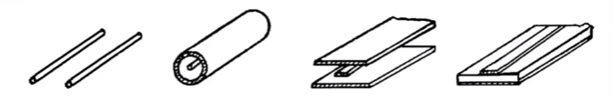
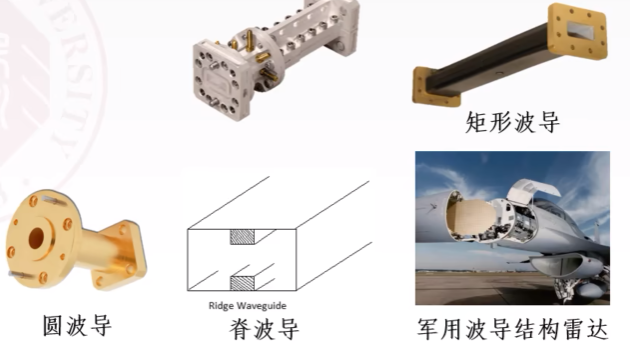
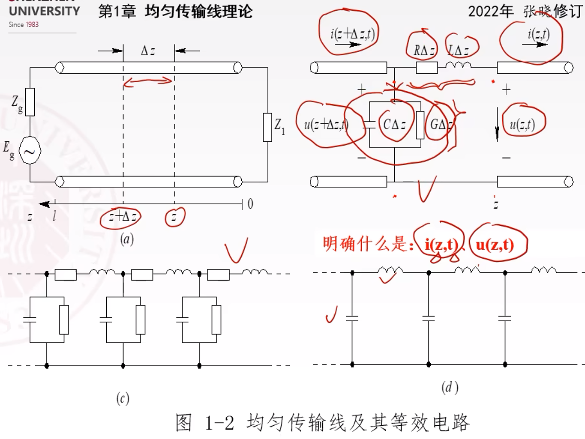
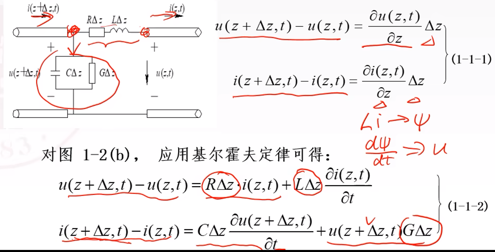
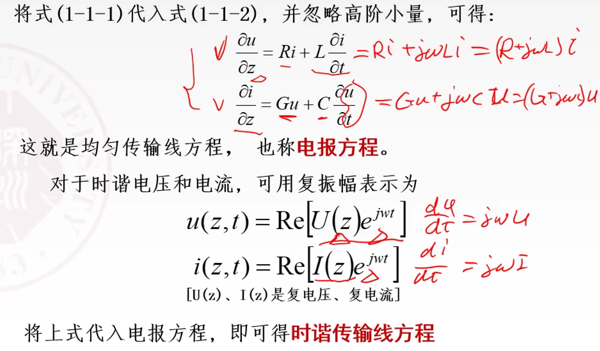
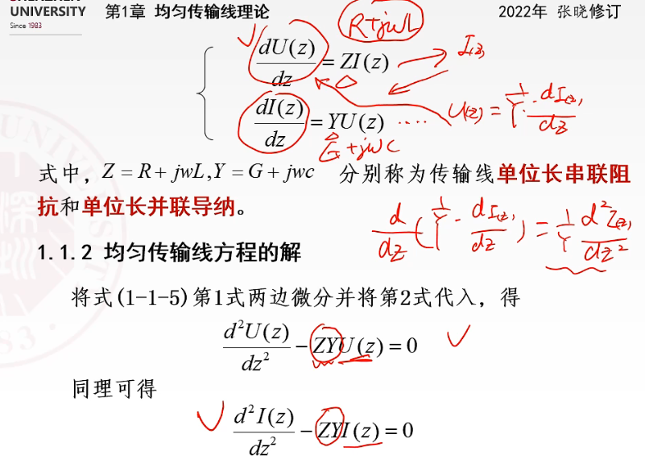
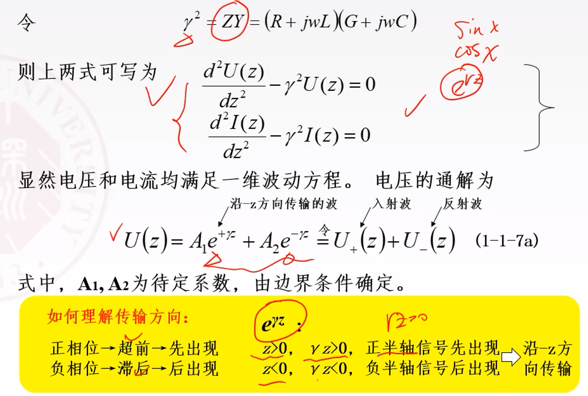
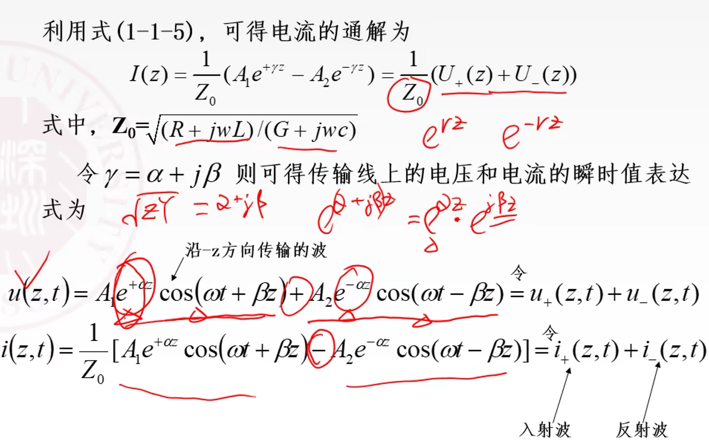

# 01传输线理论

## 1. 传输线的类型
### 1.1 双导体传输线，传输TEM波

上图分别是平行双线、同轴线、带状线、微带线。

### 1.2 波导 - 填充介质的金属波导管，传输TM、TE

特点是功率容量大、损耗低。有矩形、圆、脊型、椭圆波导等。

### 1.3 介质传输线，电磁波沿传输线表面传播

## 2. 传输线方程

短线理论：$l<\lambda$ ，低频电路，看不到线内波形，是集总参数电路；
长线理论：$l \geq \lambda$ ，高频电路，是分布参数电路，对应的电容、电感、电阻、电导用单位长度值表示。

_上图中电阻分压、电导分流。在理想情况下，$R=G=0$ ，传输线就是个 LC 谐振子。_

