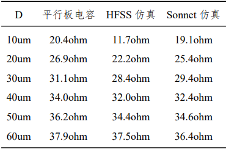

# 1. 传输线的特征阻抗

* 特征阻抗 $Z_0=\sqrt{L_0/C_0}$ ，单位长度的电感和电容分别为

	$$
	L_0=(60 \pi)^2 \epsilon_0 \frac{K(\sqrt{1-k^2})}{K(k)}
	\tag{1.1}
	$$

    $$
    C_0=2 \epsilon_0 (\epsilon^{sub}_r+1) \frac{K(k)}{K(\sqrt{1-k^2})}
    \tag{1.2}
    $$


    （K 是第一类椭圆积分，$k=\frac{s}{s+2w}$，s 是中心导体的宽度，w 是导体距地面距离、沟宽。）

* 考虑air-bridge作用，bridge 与 CPW 中心导体形成平行板电容，额外的电容 $C_b= \frac{\epsilon _0 \epsilon^{insu}_rS}{dD}$ 会引入到特征阻抗的计算当中，修正结果

    $$
    Z_0= \sqrt{L_0/(C_0+C_b)}
    \tag{1.3}
    $$

    （S 是平行板电容的面积，d 是 bridge 和 CPW 之间绝缘层的厚度，$\epsilon^{insu}_r$ 是绝缘层的相对介电常数，长度为 D 的 CPW 上有一个 bridge。）

---
e.g. 计算Z0

蓝宝石er=10，s=10，w=5；硅er=11.9，s=10，w=6。
阻抗模拟分别为52.9165，48.8644 ohm。

bridge 的宽度 W=2um，CPW 的 w 为 5um，s 为10um，绝缘层的材质为高阻硅厚度为 250nm，衬底为蓝宝石。



```py
sapphire-z0: 
参考值: 53, 计算: 52.91650051773072

si-z0: 
参考值: 49, 计算: 51.792959278048315

传输线特征阻抗, 带空气桥: 
10 20.446616684631522
20 26.97240630563695
30 31.077371770720976
40 33.98458978498537
50 36.17650801920224
60 37.89767780549763
```