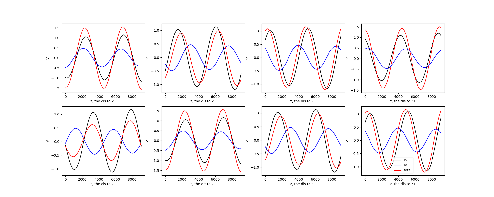
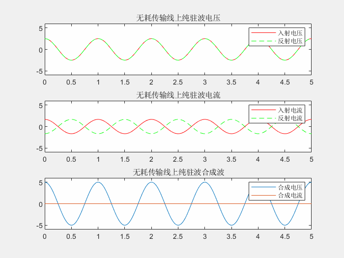

# 04反射系数和驻波比

由[[03阻抗变换特性]]传输方程 $(2.1)$ ，得出反射系数：

$$
\Gamma_u(z)=\frac{u^-}{u^+}=\frac{A_2}{A_1}e^{-2j\gamma z}=-\Gamma_i(z)
$$

令

$$
\Gamma=\frac{A_2}{A_1}=|\Gamma|e^{j\phi}
$$ 

则

$$
\Gamma_u(z)=|\Gamma|e^{j\phi-2j\gamma z}
$$

由于

$$
\frac{A_2}{A_1}=\frac{Z_1-Z_0}{Z_1+Z_0}
$$

因此，当阻抗匹配时，i.e. 负载阻抗=传输线特征阻抗，$|\Gamma|=0$ ，也就是无反射。

---

当存在反射波的情况下，由于它和入射波具有相同的频率，两者将形成一个稳定的叠加状态——驻波。

上图是在不同时间下电压入射波和反射波的情况，可以看出叠加波形的波腹和波节位置是固定不变的，因此叫做驻波。而电压驻波比 VSWR 就是入射波与反射波振幅之和 / 振幅之差：

$$
\rho=\frac{A_1+A_2}{A_1-A_2}
$$

可以用反射系数表示电压驻波比VSWR：

$$
\rho=\frac{1+\frac{A_2}{A_1}}{1-\frac{A_2}{A_1}}=\frac{1+|\Gamma|}{1-|\Gamma|}
$$

驻波比是一个反应输出效率的量。当阻抗匹配时，反射系数 = 0，驻波比 = 1，这时输出信号全部进入负载；当反射系数接近 1 时，驻波比接近无穷大，信号输出效率极低。