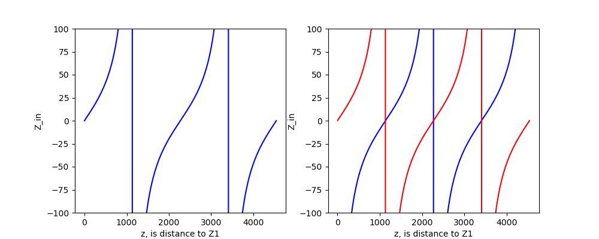

# 05全反射阻抗变换

当 $|\Gamma|=|\frac{Z_1-Z_0}{Z_1+Z_0}|=1$ 时，发生全反射，形成纯驻波。有以下三种情况：

1. $\Gamma=-1\Rightarrow Z_1=0$，对应终端短路，无负载。

    利用 [[03阻抗变换特性]]输入阻抗公式 $(2.2)$ 可得
    
	$$
	Z_{in}=Z_0\frac{Z_1+jZ_0\tan{\beta z}}{Z_0+jZ_1\tan{\beta z}}=jZ_0\tan{\beta z}
	$$

    ! 注意，此时计算仍是无损耗情况，考虑衰减常数 $\alpha$ 并不会对相位造成影响，但会让计算变得很复杂。

    并且会发现 $(Z_1-Z_0)/(Z_1+Z_0)=A_2/A_1=-1$ ，也就是说此时终端处 $u^-=-u^+$ ，说明入射波和反射波电压差一个 $\pi$ 的相位；相反，电流相等。

2. $\Gamma=1\Rightarrow Z_1\rightarrow\infty$，对应终端开路，负载无穷大。

    同样把 $Z_1$ 带入输入阻抗 $Z_{in}$ 得到

    $$
    Z_{in}=-j\frac{Z_0}{\tan{\beta z}}
    $$

    此时 $(Z_1-Z_0)/(Z_1+Z_0)=A_2/A_1=1$ ，终端处 $u^-=u^+$ ，说明入射波和反射波电压相等，但电流将差一个 $\pi$ 的相位。

3. 负载为纯电抗（虚数） $Z_1=jZ_x$ ， $|\Gamma|=|\frac{jZ_x-Z_0}{jZ_x+Z_0}|=1$。

    分析，略。
   
和有负载的情况一样，$Z_{in}$ 以 $\lambda/2$ 为周期变化，同时每经过 $\lambda/4$ 阻抗特性也发生变换，前两种情况曲线如下。

```python
计算短路阻抗: 6.9596700945357775
计算开路阻抗: -359.2124290435572
```


