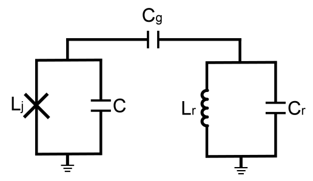

# 3. 比特与腔耦合



在 [Sec 2](02色散读取.md) 色散读取 $(9.1)(9.2)$ 中用到了比特和谐振腔的耦合系数，计算如下：

$$
g=C_g\frac{\sqrt{\omega_q\omega_r}}{2\sqrt{(C_q+C_g)(C_r+C_g)}}
\tag{10.1}
$$

! 对于比特间电容耦合，其强度计算方式同上

---

e.g. 计算耦合强度

取比特频率 5.5GHz ，电容 84.2fF ；读取腔频率 6.5GHz ，电容385fF ，耦合电容 3.3fF

```py
耦合强度: 53.52223560888545
```
