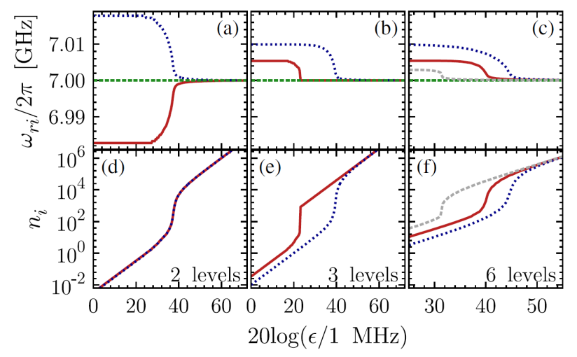
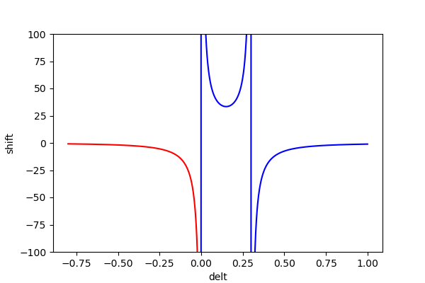

# 02色散读取


（两能级、三能级、六能级模型下，谐振腔频率/腔内光子数随测量强度的变化，红线对应的是比特处于 |0⟩，蓝色虚线对应 |1⟩，灰色虚线对应 |2⟩。）

由于比特与读取腔耦合后，读取腔本身的频率发生变化，理论上很难测量到腔的本征频率。但是当读取腔内的光子数较多时，腔的频率逐渐接近本征频率。因此 $\omega_r$ 可以采用高功率进行快速标定。

在 $g/\Delta << 1$ 的色散区域（dispersive regime），谐振子的共振频率 $\omega_r$ 受量子比特影响产生位移（shift） $\chi$ ，其中 $\Delta=\omega_q-\omega_r$ 是量子比特和谐振子的频率差。

1. 对于两能级系统，低功率下的读取腔的频率在比特不同态下有区分，而光子数几乎没有区别。

    $$
    \chi=g^2/\Delta
    \tag{9.1}
    $$
    
    * 当 $q\rightarrow\ket{1}$ , 谐振腔的共振频率发生偏移 $\omega_r+\chi$
    * 当 $q\rightarrow\ket{0}$ , 谐振腔的共振频率发生偏移 $\omega_r-\chi$
    
2. 考虑到量子比特存在更高能级，在三能级模型中，不仅低功率下频率有区别，高功率下的光子数也有区别。

    $$
    \chi=g^2/\Delta(1+\Delta/(\omega_{21}-\omega_{10}))
    \tag{9.2}
    $$

---
e.g. 求色散位移

qubit 和 res 频率差 1GHz，耦合强度为 50MHz，非谐性 -230MHz。色散位移为 -0.467Mhz。

```python
计算色散位移量: -2.5000000000000004 MHz
高阶修正: -0.467479674796748 MHz
```

