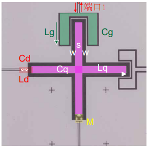

# 05控制线耦合强度



x-control 驱动强度为

$$
2g_d=\frac{C_dV_d}{C_q+C_d}\sqrt{\frac{1}{2\hbar Z_q}}
$$

其中， $C_d$ 是微波驱动电容， $V_d$ 是输入到芯片上的电压， $Z_q$ 是比特的特征阻抗

$$
Z_q=\frac{1}{\omega_qC_q}
$$

$C_q$ 的计算参考[[02特征阻抗]]中的单位长度电容 $(1.2)$ ，长度按 $4l_q$ 计算

$$
C_q=4l_qC_0=8l_q\epsilon_0 (\epsilon^{sub}_r+1) \frac{K(k)}{K(\sqrt{1-k^2})}
$$

利用上式以及非谐性 $\alpha=-E_C/\hbar=-e^2/(2C_q)/\hbar$ 可以计算出 bit 臂长

! 驱动强度一般 $g_d/2\pi>50MHz$ ，可以在 10ns 内完成单次激发。（*??? from wang th p40，未找到操作时间与 $g_d$ 的关系*）

---
e.g. 计算驱动强度

取输出电压 0.4V ，线上衰减 -60dB ，驱动电容 50fF。

```
利用非谐性计算 bit 电容: 83.98971434530235
利用 bit 频率以及 cq 计算臂长: 128.30108068130002
计算驱动强度: 44.062910147476735
```