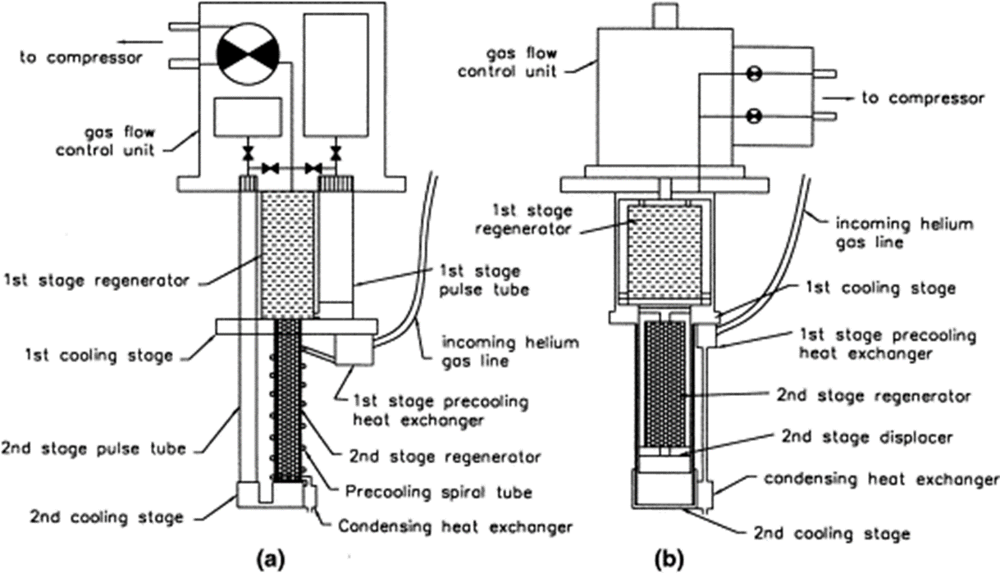
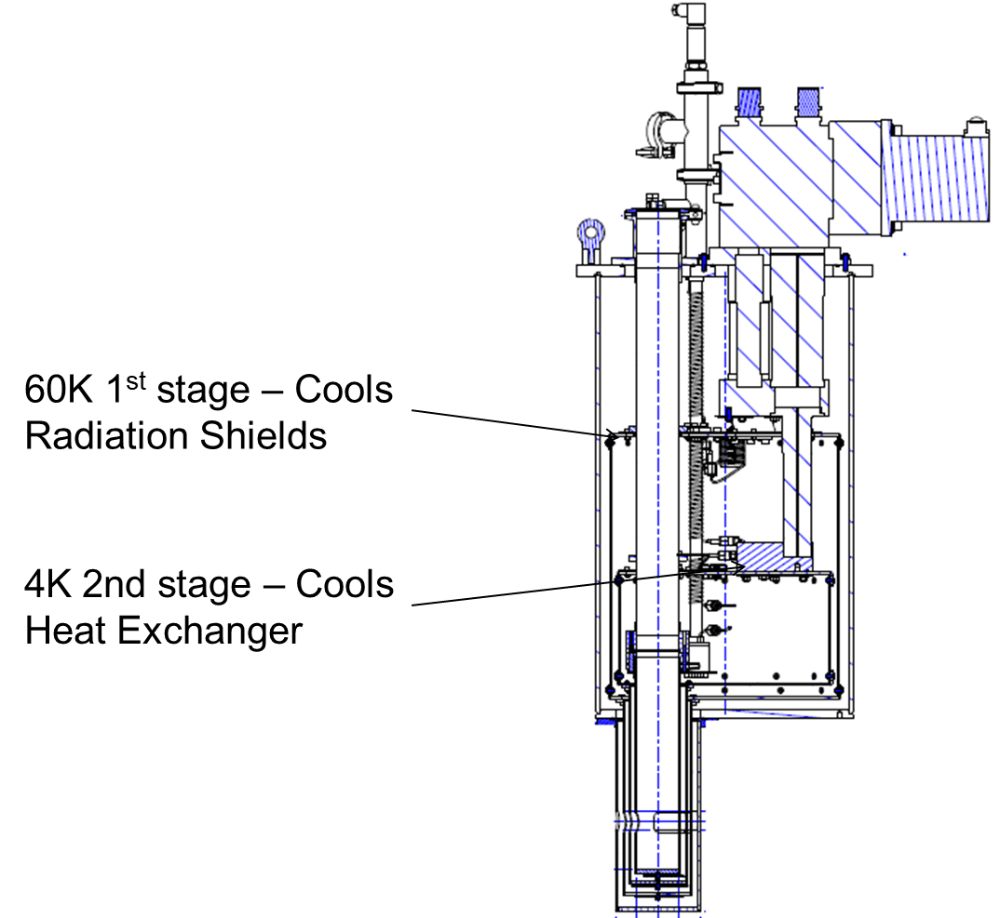

# 03GM和脉冲管制冷机_4K

## 1. 冷头

PTR – Pulse Tube Refrigerator|GM Cooler – “Gifford McMahon” cooler|
----------- | -----------|
氦气的脉冲。|有一个机械的、移动的位移器displacer。|
没有活动部件。|位移器displacer在冷却器内上下移动。|
冷阶段振动水平低。|冷阶段振动高。|
PTR冷头无需维修。(压缩机需要更换吸附器)|需要定期维修。|
更加昂贵。|价格便宜，冷却能力强。|

## 2. 冷阶

