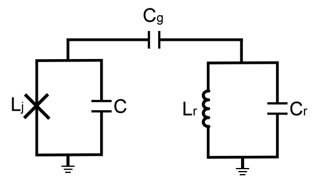

# 10. 比特与腔耦合



在 [Sec.9](09色散读取.md) 色散读取 $(9.1)(9.2)$ 中用到了比特和谐振腔的耦合系数，计算如下：

$$
g=C_g\frac{\sqrt{\omega_q\omega_r}}{2\sqrt{(C_q+C_g)(C_r+C_g)}}
\tag{10.1}
$$

! 对于比特间电容耦合，其强度计算方式同上

---

e.g. 计算耦合强度

取比特频率 5.5GHz ，电容 84.2fF ；读取腔频率 6.5GHz ，电容385fF ，耦合电容 3.3fF

```py
import numpy

def fun_g_bit_res(omeq0,cq0,omer0,cr0,cg0):
    omeq=omeq0*PI2*ghz
    cq=cq0*fm
    omer=omer0*PI2*ghz
    cr=cr0*fm
    cg=cg0*fm
    g=cg*numpy.sqrt(omeq*omer)/2/numpy.sqrt((cq+cg)*(cr+cg))
    return g/PI2/mhz # mhz

print(fun_g_bit_res(5.5,84.2,6.5,385,3.3))
```
```
53.52223560888545
```
