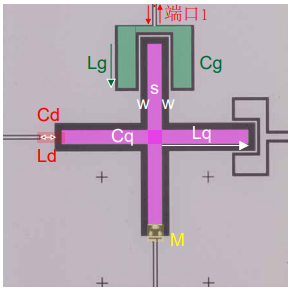

# 12. 控制线耦合强度



x-control 驱动强度为

$$
2g_d=\frac{C_dV_d}{C_q+C_d}\sqrt{\frac{1}{2\hbar Z_q}}
$$

其中， $C_d$ 是微波驱动电容， $V_d$ 是输入到芯片上的电压， $Z_q$ 是比特的特征阻抗

$$
Z_q=\frac{1}{\omega_qC_q}
$$

$C_q$ 的计算参考 [Sec.1](01传输线的特征阻抗.md) 中的单位长度电容 $(1.2)$ ，长度按 $4l_q$ 计算

$$
C_q=4l_qC_0=8l_q\epsilon_0 (\epsilon^{sub}_r+1) \frac{K(k)}{K(\sqrt{1-k^2})}
$$

利用上式以及非谐性 $\alpha=-E_C/\hbar=-e^2/(2C_q)/\hbar$ 可以计算出 bit 臂长

! 驱动强度一般 $g_d/2\pi>50MHz$ ，可以在 10ns 内完成单次激发。（*??? from wang th p40，未找到操作时间与 $g_d$ 的关系*）

---
e.g. 计算驱动强度

取输出电压 0.4V ，线上衰减 -60dB ，驱动电容 50fF。

```py
import numpy

# 利用非谐性计算 bit 电容
def fun_cq(alph0):
    alph=alph0*PI2*mhz
    cq=-E**2/HBAR/alph/2
    return cq/fm # fF

# 利用 bit 频率以及 cq 计算臂长
def fun_lq(epsub,s0,w0,wq0,cq0):
    cq=cq0*fm
    s=s0*um # um
    w=w0*um
    k=s/(s+2*w)
    lq=cq*scipy.special.ellipk(numpy.sqrt(1-k**2))/scipy.special.ellipk(k)/(8*EP0*(epsub+1))
    return lq/um

# 计算驱动强度
def fun_g_drive(omeq0,cq0,cd0,vdstart,db):
    omeq=omeq0*PI2*ghz
    cq=cq0*fm
    cd=cd0*fm
    vd=vdstart*10**(db/10) # 计算衰减后的电压强度
    zq=1/omeq/cq
    gd=cd*vd/(cq+cd)/numpy.sqrt(2*HBAR*zq)/2
    return gd/PI2/mhz

print(fun_cq(-230))
print(fun_lq(11.9,10,6,5.5,84))
print(fun_g_drive(5.5,84,50,0.4,-60))
```
```
83.98971434530235
128.30108068130002
44.062910147476735
```
