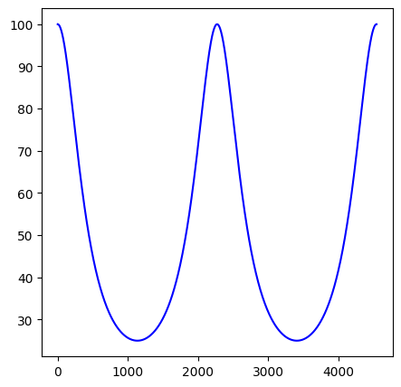

# 2、λ/4阻抗变换特性

<font size=2>

传输线方程由入射波+反射波两部分组成：
$$
u=A_1e^{\gamma z}e^{j\omega t}+A_2e^{-\gamma z}e^{j\omega t}\\
i=(A_1e^{\gamma z}e^{j\omega t}-A_2e^{-\gamma z}e^{j\omega t})/Z_0
\tag{2.1}
$$
输入阻抗
$$
Z_{in}=u(z,t)/i(z,t)=u(z)/i(z)=Z_0\frac{A_1e^{\gamma z}+A_2e^{-\gamma z}}{A_1e^{\gamma z}-A_2e^{-\gamma z}}
$$
* 考虑边界条件
    $$
    u(0)/i(0)=Z_0\frac{A_1+A_2}{A_1-A_2}\equiv Z_1\\
    i.e.\quad A_1/A_2=(Z_1+Z_0)/(Z_1-Z_0)
    $$
* 考虑无损耗传输 $\gamma=\alpha+j\beta\Rightarrow j\beta, where \quad \alpha=0$

输入阻抗化简为
$$
Z_{in}=Z_0\frac{Z_1+jZ_0\tan{\beta z}}{Z_0+jZ_1\tan{\beta z}}
\tag{2.2}
$$

</font>

可以看出，当 $z=k\frac{\pi}{\beta}=k\frac{\lambda}{2}, \quad \beta=2\pi/\lambda$ 时， $\beta z=k\pi \Rightarrow Z_{in}=Z_1$ 。该特性称作 $\lambda/2$ 阻抗重复性，下面画图展示。

```py
import numpy

# 计算输入阻抗
def fun_zin(z,z0,z1,lamb):
    bet=PI2/(lamb*um) # um
    zin=z0*(z1+1j*z0*numpy.tan(bet*z*um))/(z0+1j*z1*numpy.tan(bet*z*um))
    return zin.real

lamb=4549
print(fun_zin(lamb/2,50,100,lamb))
```
```
100.0
```
```py
import matplotlib.pyplot as plt
import numpy
fig=plt.figure(figsize=(5,5))

lam=4543 # um
x=numpy.linspace(0,lam,1000)
y=fun_zin(x,50,100,4543)
ax=fig.add_subplot()
ax.plot(x,y,'b')
plt.show()
```
