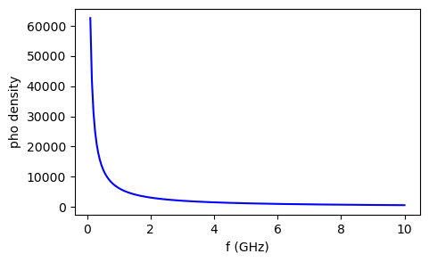
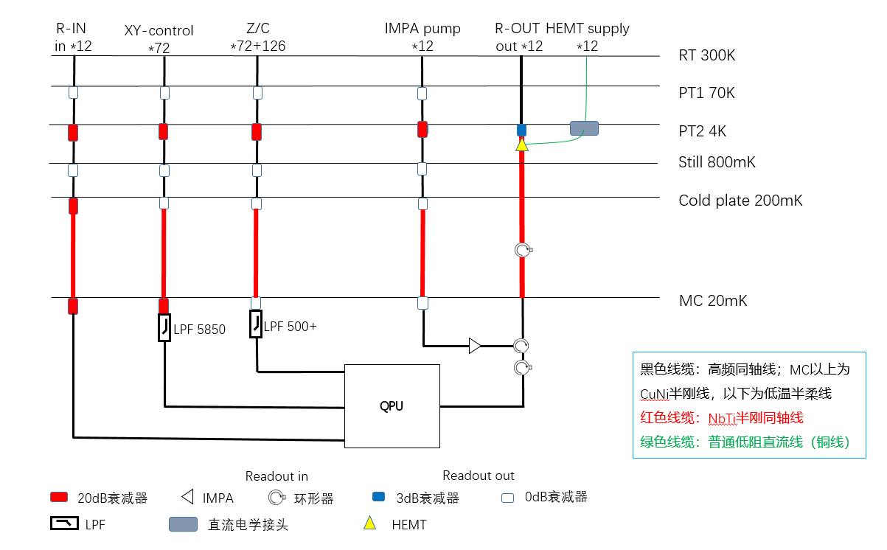
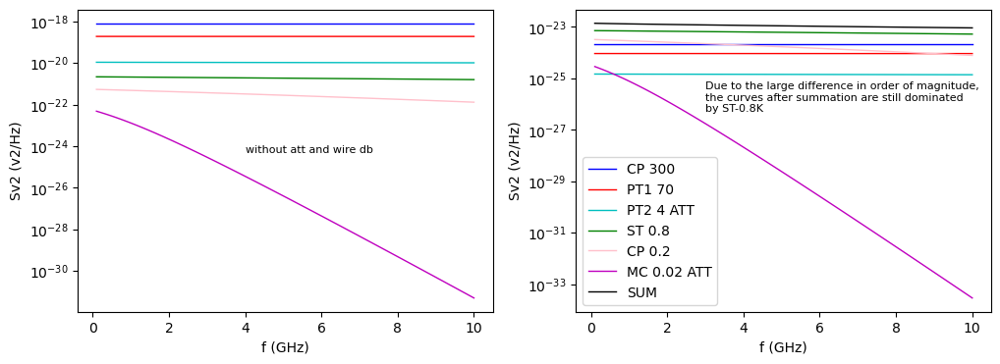

# 1. 电压噪声谱密度

温度会导致导体内部的自由电子不断进行热运动，对于阻值为 R 的电阻，Johnson-Nyquist 噪声的电压谱密度（单位： $V^2/Hz$ ，等于功率谱密度 * R）为：

$$
S_{V2}(f,R,T) = 4k_BRT \frac{hf}{k_BT} \frac{1}{exp(hf/k_BT)-1}
\tag{1.1}
$$

在 300K 常温下，RF 频段（GHz），$hf<<k_BT$ （比值约在万分之一）。计算得到 $hf\frac{1}{exp(hf/k_BT)-1}\approx k_BT$，也就是说 $S_{V2}\approx 4k_BRT$，这就是白噪声。

并且，白噪声的频谱是均匀分布的，在所有频率上都有相同的能量密度。从量子的角度解释，温度引起了光子数涨落，进而和量子比特耦合，其密度为 $n(T,f)=\frac{1}{exp(hf/k_BT)-1}$ 。（单位： $Hz^{-1} s^{-1}$ )

从上图可以看到，频率越高，热激发产生的光子数密度越低，但是同时光子频率越高，单光子能量也高，因此最终的噪声密度 $S_{V2}\approx 4k_BRT$ 仍是一个与 f 无关的定值（在 300K 下）。

<mark>Q1：既然热噪声分布在全频段，并且其强度仅和温度有关，和输入信号无关。那么这里为何仅针对 f 频率的热光子？是否热噪声仅仅对相应频率的信号影响较大？</mark>

A1：在 REF.KONG.P57 找到了答案 “对于 qubit readout 线路来说，实际有影响的是频率𝑓𝑐附近的噪声成分”，这对于其他线路应该也是一样的。
- XY 通道信号频率在 4-6 GHz
- READOUT-IN 频率 6-8 GHz

两个通道的光子数密度为：1249 和 892\
频率范围内积分，总光子数分别是 2533 和 1797

现在考虑降低光子数密度，各线缆通道需要多少衰减：
- XY 通道降低到 $10^{-2}$ 以下，需要 51dB
- READOUT-IN 降低到 $10^{-3}$ 以下，需要 60dB

<mark>Q2：这里计算得到READOUT-IN需要衰减为 60dB ，与预期的 70dB 有出入（线缆损耗约为10）。该问题暂存。</mark>

---

实际上，每层的热源都会产生热噪声。接下来考虑按上图的设计，XY 通道上每一层产生的热噪声经过后级逐级衰减之后，到达 base (MC) 层时的噪声谱密度。

不同线缆单位长度的插损可以从 REF.某计算环境支撑系统项目方案（ZB) -0908.docx 中获得：

（1）高密度半刚线插损约为15.6dB/m
- RT-PT1：15.6 dB/m×0.18m＝2.808dB
- PT1-PT2：15.6 dB/m×0.286m＝4.4616dB
- PT2-Still：15.6 dB/m×0.248m＝3.8688dB
- Still-CP：15.6 dB/m×0.166m＝2.5896dB

（2）普通密度半刚线插损约为15dB/m
- RT-PT1：15 dB/m×0.25m＝3.75dB
- PT1-PT2：15dB/m×0.265m＝3.975dB
- PT2-Still：15dB/m×0.22m＝3.3dB
- Still-CP：15 dB/m×0.07m＝1.05dB

（3）CP-MC 使用的是 NbTi 线，极低温下基本没有损耗；300mm 半柔线插损为1.44dB，\
（4）LPF 5850+插损为0.83dB；LPF 500+插损为0.94dB。

可以看出
- 只有在 20 mK 层，噪声谱对频率敏感，这时热光子能量 $hf$ 接近热力学标度 $k_BT$；
- 由于在 4-6 GHz 范围，20 mK 层与其他层存在数量级上的差异，求和后的谱密度曲线（black）仍以 ST-0.8K 层（green）为主。
