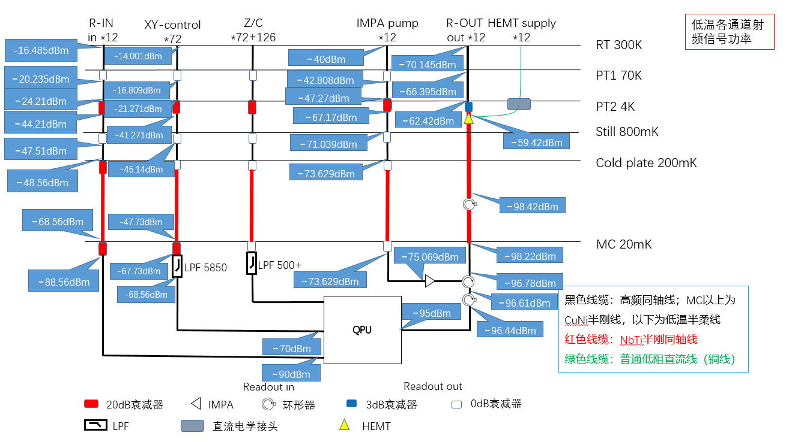

# 3. 线缆热负荷

无论是线缆的损耗，还是衰减器或者滤波器，最终都是将射频能量转化成热能散失，因此对于每层的热载功率，可以通过设置信号初始输入功率逐层计算。

使用的 XY 模块输出功率范围 -40~-10dBm，即最大功率不超过 100uW。

- 对于 xy ，各层的功耗如下：

	LAYER | 输入功率dBm | 输出功率dBm | 单通道发热功率uw
	----|----|----|----
	RT-PT1 | -14.001 | -16.809 | 18.95184225
	PT1-PT2 | -16.809 | -21.271 | 13.38694008
	PT2-ST | -21.271 | -45.14 | 7.43214939
	ST-CP | -45.14 | -47.73 | 0.0137541
	CP-MC | -47.73 | -47.73 | 0
	MC-QPU | -47.73 | -70 | 0.01676553

- 计算 READOUT-IN 通道和 XY 类似。
- Z-control 通道上是低频信号，对 qubit 的主要影响是 dephasing。假设 Z 线的输入阻抗为 R，到 qubit 的 SQUID 环的互感为 M， Z 的电压噪声谱密度可以转化为磁通噪声谱密度、qubit频率波动

$$
S_\phi(\omega)=(M/R)^2S_{v2}(\omega)
\tag{3.1}
$$

$$
S_{\omega_q}=(\partial{\omega_q}/\partial{\phi})^2S_\phi(\omega)
\tag{3.2}
$$

经过 REF.KONG.P60 的计算，从 Z-control 线路引入的白噪声可以完全忽略。