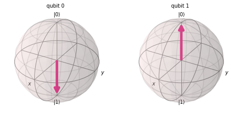

# CNOT门分解

CNOT 门的矩阵形式为：

$$
CNOT = \left[\begin{matrix}
1&0&0&0\\
0&1&0&0\\
0&0&0&1\\
0&0&1&0\\
\end{matrix}\right]
$$

i.e.

$$
CNOT = P_0 \otimes I + P_1 \otimes X
$$

在这里，

$$
P_0 = \left[\begin{matrix}
1&0\\
0&0\\
\end{matrix}\right],
P_1 = \left[\begin{matrix}
0&0\\
0&1\\
\end{matrix}\right]
$$

注意 ！

$$
P_0 \ket{0} = \ket{0}, P_0 \ket{1} = 0,\\
P_1 \ket{0} = 0, P_1 \ket{1} = \ket{1}
$$

将该门分别作用在 $\ket{01}$ 态和 $\ket{10}$ 态

$$
CNOT \ket{01} = 
(P_0 \otimes I + P_1 \otimes X) \ket{01}\\
= P_0 \ket{0} \otimes I \ket{1} + 0 = \ket{01},\\
CNOT \ket{10} = 
(P_0 \otimes I + P_1 \otimes X) \ket{10}\\
= 0 + P_1 \ket{1} \otimes X \ket{0} = \ket{11}
$$

以上是正常的公式计算的结果，然而在使用qiskit或者其他编程语言中，却遇到了不同的情况。

# Little endians
在 qiskit 中有 `UnitaryGate` 工具可以将矩阵转化为量子门，如：
```python
from qiskit import QuantumCircuit
from qiskit.extensions import UnitaryGate

matrix1 = [[1, 0, 0, 0],
          [0, 1, 0, 0],
          [0, 0, 0, 1],
          [0, 0, 1, 0]]
gatecx = UnitaryGate(matrix1)

circuit = QuantumCircuit(2,2)
circuit.x(0)
circuit.append(gatecx,[0,1])
circuit.draw('mpl',scale=0.6)
```

我们预计上述代码的结果应该是 $\ket{11}$，但结果出乎意料：



---
原因是在 qiskit 中，qubit 编码方式为 “Little endians”，叫做 “小端编码”，或者 “末端编码”。即，倒序排列 $\ket{q3q2q1q0}$。

因此，在做计算时矩阵也是倒序作用 $B \otimes A$，表示 A 和 B 分别作用在 $q0$ 和 $q1$ 上。据此分析，构造 CNOT 的思路应该是：

$$
CNOT = I \otimes P_0 + X \otimes P_1
$$

所以在qiskit中，构造CNOT门应该使用的矩阵是：

$$
CNOT = \left[\begin{matrix}
1&0&0&0\\
0&0&0&1\\
0&0&1&0\\
0&1&0&0\\
\end{matrix}\right]
$$

